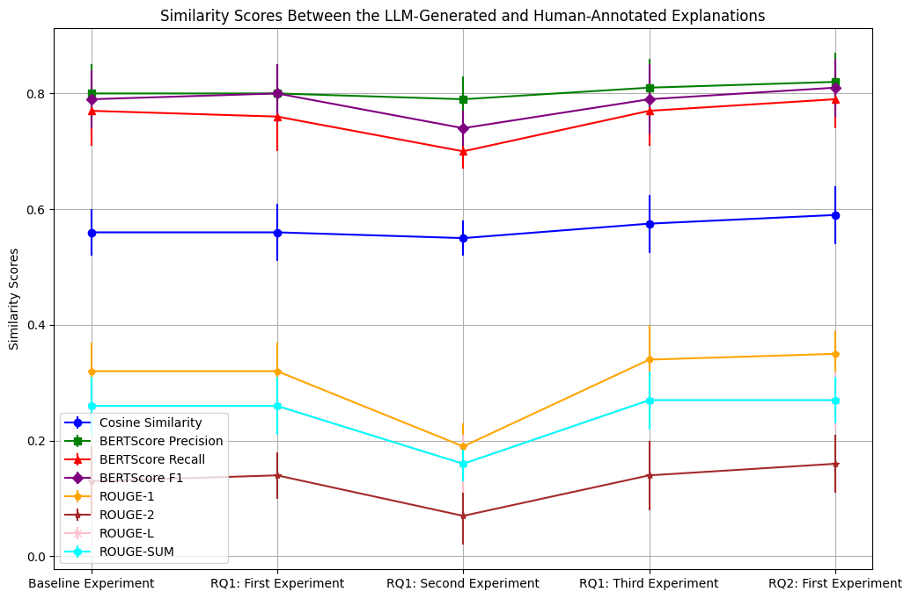

Master thesis project exploring the following 2 research questions utilizing the e-SNLI dataset. 
Research Question 1: Does providing explanations generated by the LLM itself influence the LLM's ability to perform the NLI task differently? if so, in what manner?
Research Question 2: Can the LLM generate explanations that are comparable to human-like explanations for the NLI task?
The LlaMa 2 chat 70b model is utilized throughout all experiments with temperature 0.7 and top-p 0.6.  
The results indicate that in fact LLM LLM-generated explanations influence the LLM decision-making process and are comparable to human-annotated explanations when generated with fine instructions. 

